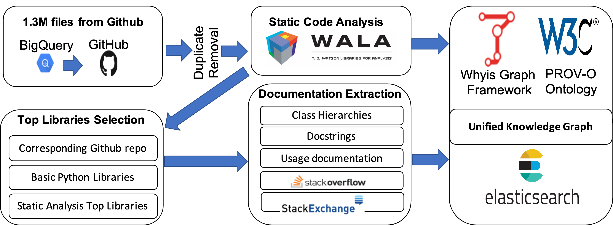
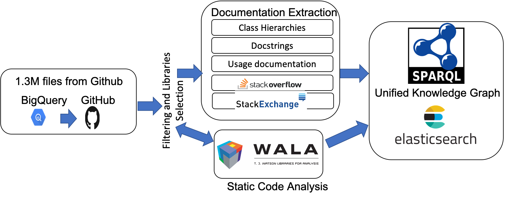

# GraphGen4Code
Knowledge graphs have been proven extremely useful in powering diverse applications in semantic search and natural language understanding. In this work, we present GraphGen4Code, a toolkit to build code knowledge graphs that can similarly power various applications such as program search, code understanding, bug detection, and code automation. GraphGen4Code uses generic techniques to capture code semantics with the key nodes in the graph representing classes, functions and methods. Edges indicate function usage (e.g., how data flows through function calls, as derived from program analysis of real code), and documentation about functions (e.g., code documentation, usage documentation, or forum discussions such as StackOverflow). Our toolkit uses named graphs in RDF to model graphs per program, or can output graphs as JSON. We show the scalability of the toolkit by applying it to 1.3 million Python files drawn from GitHub, 2,300 Python modules, and 47 million forum posts. This results in an integrated code graph with over 2 billion triples. We make the toolkit to build such graphs as well as the sample extraction of the 2 billion triples graph publicly available to the community for use.

Website: https://wala.github.io/graph4code/

# Applications
* [Automated Machine Learning (AutoML)](./docs/use_cases.md#autoML)
* [Building Language Models for Code Understanding](./docs/use_cases.md#lm)
* [Large Scale Generation of Labeled Type Data for Python](./docs/use_cases.md#type_inf)
* [Recommendation engine for developers](./docs/use_cases.md#case1)   
* [Enforcing best practices](./docs/use_cases.md#case2)  
* [Learning from big code](./docs/use_cases.md#case3) 

# Create your own graph

### GraphGen4Code Pipeline<a name="pipeline"></a>

The figure below shows the overall pipeline of steps followed by GraphGen4Code to generate large-scale code knowledge graphs. 

<!----->
<p align="center">

</p>
<br><br>

We used the above pipeline to demonstrate the scalability of GraphGen4Code by creating a code knowledge graph of 2 billion facts about code. This graph was created using 1.3 million Python program and 47 million forum posts. The graph files are available [here](https://archive.org/download/graph4codev1). To load and query this data, please follow the instructions here: https://github.com/wala/graph4code/blob/master/docs/load_graph.md. We also provide scripts for creating a docker image with the graph database ready to use. 

We list below the steps needed to create your own graph.

## Requirements

In addition to installing the required  packages in `requirements.txt`, the steps below require a working installation of `ElasticSearch` running on the default port, 9200. It also need an installation of `Java JDK 11`.

## Code Analysis Graph

If you have a new script (code file), run the following command in the jars directory.  Please ensure you have Java 11 before you run.  Note that the last two arguments are to create a unique graph URI for each script that gets analyzed, where the graph URI is made up of <graph prefix> + '/' + <graph qualifier> for a single file.  Note also that we have migrated the RDF store model to RDF* to make it a more compact, easier to understand representation.  We have also added more information about each node.  Model definition will be updated soon.

We provide analysis for both Python 2 and Python 3.  Python 3 is the supported version of Python, but, while Python 2 is no longer supported, many existing datasets have significant quantities it.  Since the two languages have different syntax in some cases, we need two different analyses that rely on diffferent parsers, and hence we have two analysis jars.

Their usage is `java -DoutputDir=<output dir to store JSON representation of graph> -DquadFile=<file name to write quads to - this file gets appended to, so all analyzed scripts end up in a single file> -cp codebreaker*n*.jar util.RunTurtleSingleAnalysis <python script to run on> <graph prefix> <graph qualifier>` where *n* is either 2 or 3 depending on the desired version of Python.  
 
 As an example, from the jars directory: `java -DoutputDir=<output dir to store JSON representation of graph> -cp codebreaker3.jar util.RunTurtleSingleAnalysis <python script to run on> null null` to run on a Python 3 file, with an output of the graph on JSON.
 
 Note that we use git lfs to store the jars.   Please use `git lfs pull` to pull the jars - their sizes should be above 50M.  

## Collecting documentation (docstrings) for your scripts
 
 1. Run `python generate_top_modules.py <DIR containing all analysis output>/*.json <OUTPUT_TOP_MODULES_PATH> <number for top K modules by count>`.
 2. From the scripts dir, run: `sh inspect_modules_for_docstrings.sh <OUTPUT_TOP_MODULES_PATH> <OUTPUT_TO_WRITE_EXTRACTED_DOCSTRINGS> <ANACONDA_HOME>`.
 
## Creating docstrings graph
Using the output of the above step, run the following from inside the `src` directory 
 `python create_docstrings_graph --docstring_dir <directory where docstrings from above directory are saved> --class_map_file ../resources/classes.map --out_dir <where nq files will be saved`
 
 
 ## Creating Forums graph
To create a forum graph, first download the corresponding data dump from StackOverflow or StackExchange from https://archive.org/details/stackexchange. You then need to extract the zipped file into a folder <stackoverflow_in_dir> and run the following: 

following:
`python -u create_forum_graph.py --stackoverflow_in_dir <stackoverflow_in_dir> --docstring_dir <directory where docstrings from above directory are saved> --graph_output_dir <where graph nq files will be saved> --pickled_files_out <intermediate directory for saving stackoverflow dumps> --index_name <elastic search index name> --graph_main_prefix <prefix used for graph generation>`

As an example, to create a graph from https://ai.stackexchange.com/ and link it to docstrings and code analysis graphs, one can run the following: 

`python -u create_forum_graph.py --stackoverflow_in_dir ./data/stackexchange_data_dump/ai_stackexchange/ --docstring_dir ./data/docstrings_data/ --graph_output_dir ./data/stackexchange_data_dump/nq/ --pickled_files_out ./data/stackexchange_data_dump/ai_stackexchange/ --index_name ai_stackexchange --graph_main_prefix  ai_stackexchange`

Current accepted prefixes are ai_stackexchange, math_stackexchange, datascience_stackexchange, stats_stackexchange, and stackoverflow3. 

# Publications<a name="papers"></a>
* If you use Graph4CodeGen in your research, please cite our work:

 ```
@article{abdelaziz2020codebreaker,
     title={A Demonstration of CodeBreaker: A Machine Interpretable Knowledge Graph for Code},
     author={Abdelaziz, Ibrahim and Srinivas, Kavitha and Dolby, Julian and  McCusker, James P},
     journal={International Semantic Web Conference (ISWC) (Demonstration Track)},
     year={2020}
}
@article{abdelaziz2021graph4code,
     title={A Toolkit for Generating Code Knowledge Graphs},
     author={Abdelaziz, Ibrahim and Dolby, Julian and  McCusker, James P and Srinivas, Kavitha},
     journal={The Eleventh International Conference on Knowledge Capture (K-CAP)},
     year={2021}
}
@inproceedings{abdelaziz2022blanca,
      title={Can Machines Read Coding Manuals Yet? -- A Benchmark for Building Better Language Models for Code Understanding}, 
      author={Ibrahim Abdelaziz and Julian Dolby and Jamie McCusker and Kavitha Srinivas},
      booktitle={Proceedings of the AAAI Conference on Artificial Intelligence (AAAI 2022)},
      year={2022}
}
```

  
# Questions
For any question, please contact us via email: ibrahim.abdelaziz1@ibm.com, kavitha.srinivas@ibm.com, dolby@us.ibm.com
  


