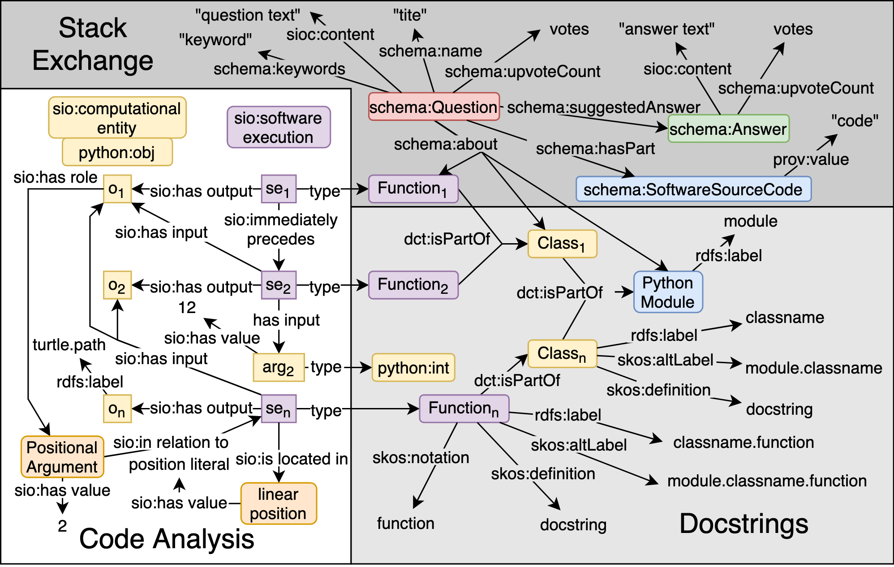

Knowledge graphs have proven to be extremely useful in powering diverse applications in semantic search and natural language understanding. Graph4code is an effort to build a knowledge graph about program code to similarly power diverse applications such as program search, code understanding, refactoring, bug detection, and code automation.  The graph uses generic techniques to capture the semantics of Python code. The key nodes in the graph are classes, functions and methods in popular Python modules.  Edges indicate *function usage* (e.g., how data flows through function calls, as derived from program analysis of real code), and *documentation* about functions (e.g., code documentation, usage documentation, or forum discussions such as StackOverflow).  We make extensive use of named graphs in RDF to make the knowledge graph extensible by the community. We describe a set of generic extraction techniques that we applied to over 1.3M Python files drawn from GitHub, over 2,300 Python modules, as well as 47M forum posts to generate a graph with almost 2 billion triples. We also provided a number of initial use cases of the knowledge graph in code assistance, enforcing best practices, debugging and type inference. The graph and all its artifacts are available to the larger community for use. 


### Table of Contents
1. [How Graph4Code is created?](#pipeline)
2. [Graph4Code Schema?](#schema)
3. [Download Graph4Code](#datasets)
3. [Example Use Cases](#uses)
    * [Recommendation engine for developers](#case1)
    * [Enforcing best practices](#case2)  
    * [Learning from big code](#case3) 
4. [Publications](#papers)


### How Graph4Code is created?<a name="pipeline"></a>

<!----->
<p align="center">

</p>
<br><br>

### Graph4Code Schema<a name="schema"></a>

<p align="center">

</p>
<br><br>

### Download Graph4Code<a name="datasets"></a>
* Download the datasets as nquads [here](http://graph4code.whyis.io/download/).


### Example Use Cases<a name="uses"></a>

#### Recommendation engine for developers<a name="case1"></a>
CodeBreaker is a coding assistant built on top of Graph4Code to help data scientists write code.  The coding assistant helps users find the most plausible next coding step, finds relevant stack overflow posts based purely on the users' code, and allows users to see what sorts of models other people have constructed for data flows similar to their own.  CodeBreaker uses the Language Server Protocol (LSP) to provide integration with any IDE.  For a detailed description of this use case, see the [demo paper](https://github.com/wala/graph4code/blob/master/papers/CodeBreaker_SigDemo.pdf).

#### Enforcing best practices<a name="case2"></a>
Many best practices for API frameworks can be encoded into query templates over data flow and control flow.  Here we give three such examples for data science code, along with queries which can be templatized.
  
  * Check that users developing data science code create multiple models on the same dataset, since machine learning algorithms vary greatly in terms of performance on different datasets ([see query here](https://github.com/wala/graph4code/blob/master/usage_queries/ensure_multiple_models.sparql)).  Here is an example result from the query.  As shown in the example, only one model is used to train ona  given dataset.

<a name="Example violation of best practice to create multiple models"></a>

<p align="center">

</p>
<br><br>

  * Check that the users use some sort of libraries for hyper-parameter optimization when building their models ([see query here](https://github.com/wala/graph4code/blob/master/usage_queries/must_not_set_hyperparameters.sparql)).  Here is an example result from the query - the analysis found all three examples of manual sets to hyperparameters.

<a name="Example violation of best practice to not set hyper-parameters manually"></a>

<p align="center">

</p>
<br><br>

  * Check that users developing data science code create the model with a different dataset than the ones they use to validate the model ([see query here](https://github.com/wala/graph4code/blob/master/usage_queries/train_test_different_data.sparql)).

<a name="Example violation of best practice to use different datasets to train"></a>

<p align="center">

</p>
<br><br>

#### Learning from big code<a name="case3"></a> 

There has been an explosion of work on mining large open domain repositories for a wide variety of tasks (see [here](https://ml4code.github.io/papers.html)).  We sketch a couple of examples for how Graph4Code can be used in this context.
  * As an example, again, from a data science use case, the arguments flowing into constructors of models govern the behavior of a model to a large extent.   These so-called hyperparameters are often optimized by some sort of search technique over the space of parameters.  Hyperparameter optimization can be seeded with the appropriate values using query here to restrict search, using any of the standard hyper parameter optimization packages ([see query here](https://github.com/wala/graph4code/blob/master/usage_queries/find_hyperparameter_distributions.sparql)).

<a name="Example hyperparameter distributions"></a>

<p align="center">

</p>
<br><br>

  * The graphs themselves can be used to perform automated code generation by using them as training sets.  As an example, [Code2seq](https://arxiv.org/pdf/1808.01400.pdf) is a system that generates natural language statements about code (e.g. predicting Java method names) or code captioning (summarizing code snippets).  Code2seq is based on an AST representation of code.  Graph4Code can be used to generate richer representations which may be better suited to generate code captioning.

### Publications<a name="papers"></a>
* If you use Graph4Code in your research, please cite our paper:

 ```
 @article{srinivas2020graph4code,
  title={Graph4Code: A Machine Interpretable Knowledge Graph for Code},
  author={Srinivas, Kavitha and Abdelaziz, Ibrahim and Dolby, Julian and McCusker, James P},
  journal={arXiv preprint arXiv:2002.09440},
  year={2020}
}
```

