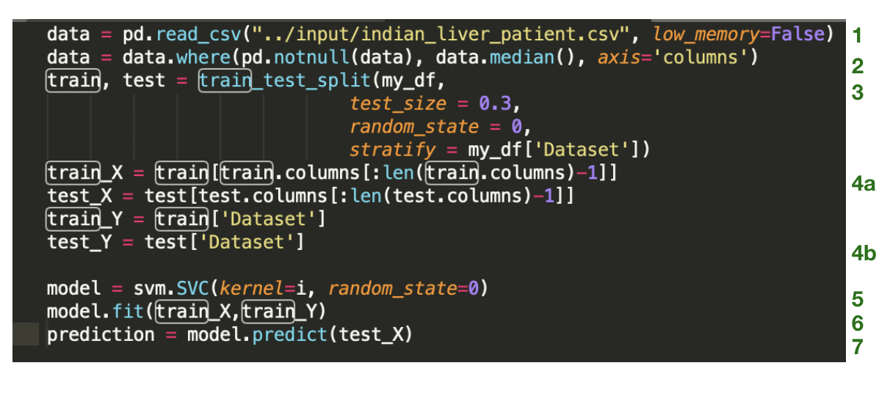
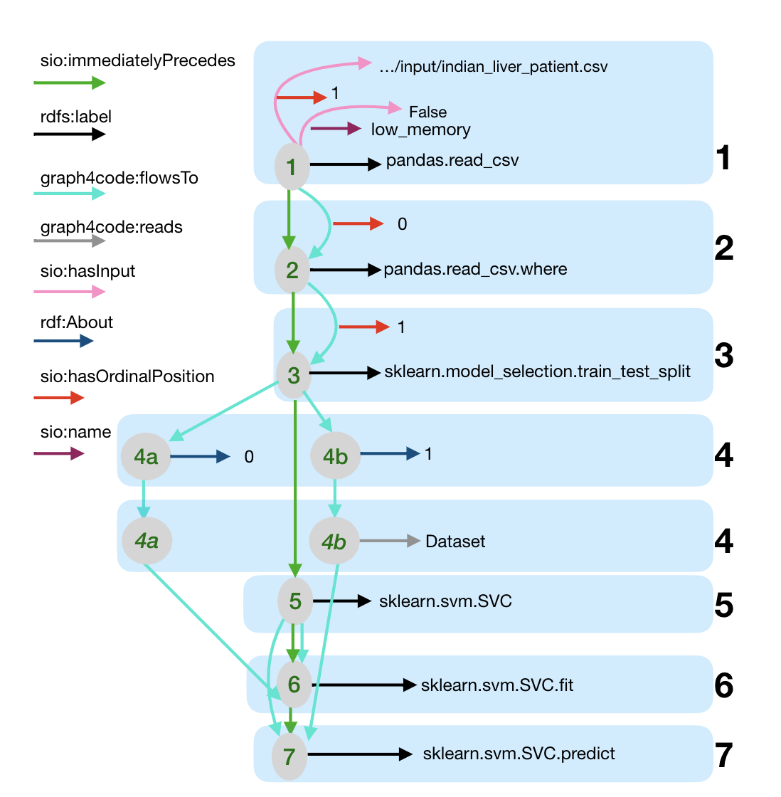
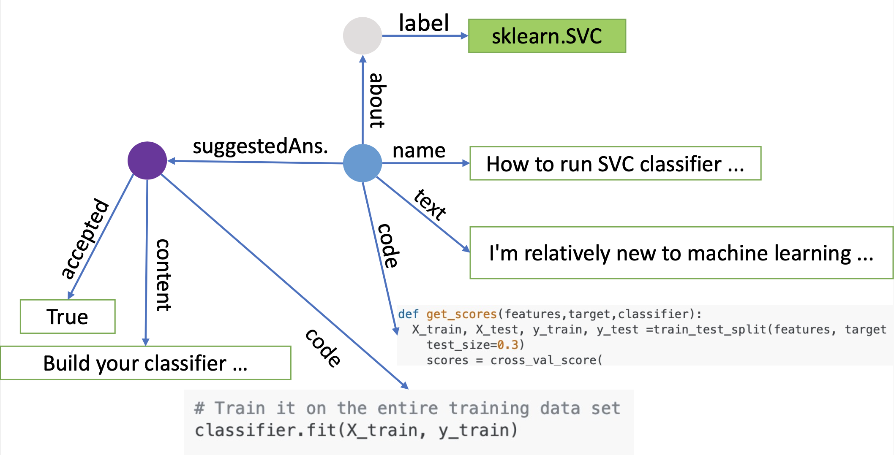
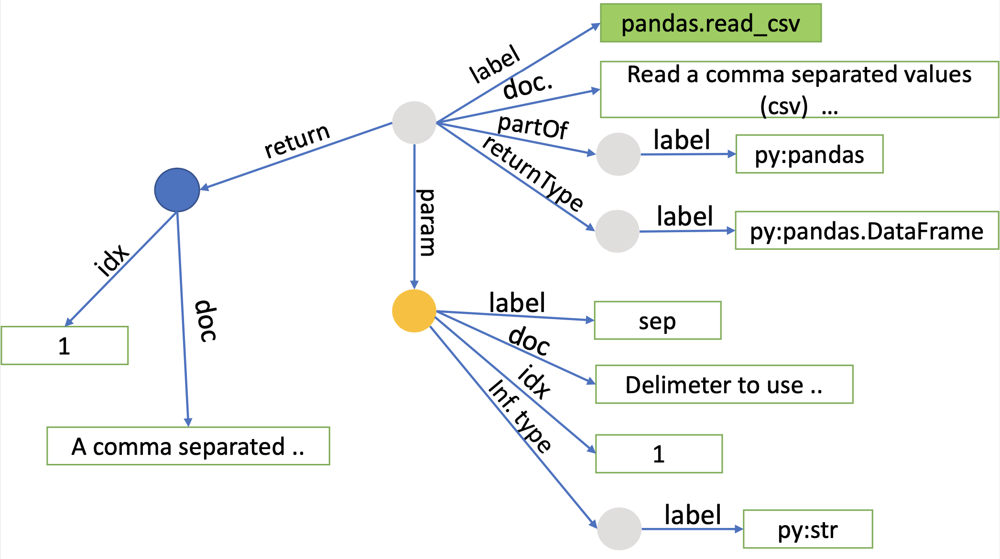

Knowledge graphs have been proven extremely useful in powering diverse applications in semantic search and natural language understanding.
In this work, we present GraphGen4Code, a toolkit to build code knowledge graphs that can similarly power various applications such as program search, code understanding, bug detection, and code automation. GraphGen4Code uses generic techniques to capture code semantics with the key nodes in the graph representing classes, functions and methods. Edges indicate function usage (e.g., how data flows through function calls, as derived from program analysis of real code), and documentation about functions (e.g., code documentation, usage documentation, or forum discussions such as StackOverflow). Our toolkit uses named graphs in RDF to model graphs per program, or can output graphs as JSON. We show the scalability of the toolkit by applying it to 1.3 million Python files drawn from GitHub, 2,300 Python modules, and 47 million forum posts. This results in an integrated code graph with over 2 billion triples. We make the toolkit to build such graphs as well as the sample extraction of the 2 billion triples graph publicly available to the community for use.

* Paper: [https://arxiv.org/abs/2002.09440](https://arxiv.org/abs/2002.09440)<br>
* Download Graph4Code dataset as nquads from [here](https://archive.org/download/graph4codev1).


### Table of Contents
1. [Graph4CodeGen Pipeline](#pipeline)
2. [Loading and querying Graph4CodeGen](./load_graph.md#loading)
3. [Schema](#schema)
4. [Deploying and using Graph4Code](#deploy)
5. [Processing New Python Programs](#process_new) 
6. [Example Queries](./example_queries.md)
7. [Example Use Cases](./use_cases.md)
    * [Recommendation engine for developers](./use_cases.md#case1)
    * [Enforcing best practices](./use_cases.md#case2)  
    * [Learning from big code](./use_cases.md#case3) 
8. [Publications](#papers)

### Graph4CodeGen Pipeline<a name="pipeline"></a>

<!----->
<p align="center">

</p>
<br><br>

   
### Schema<a name="schema"></a>

The following shows a code snippet example as well as a _high level overview_ of the information generated by Graph4CodeGen from StackOverflow and docstrings. We provide a random sample of each data source in _RDF_ format [here](https://github.com/wala/graph4code/tree/master/sample_graph). 

 

<!----->
<p align="center">

</p>
<br><br>

<!----->
<p align="center">

</p>
<br><br>


<!----->
<p align="center">

</p>
<br><br>


<!----->
<p align="center">

</p>
<br><br>


### Deploying and using Graph4CodeGen <a name="deploy"></a>

The graph files are available [here](https://archive.org/download/graph4codev1). 

To load and query this data, please follow the instructions here: https://github.com/wala/graph4code/blob/master/docs/load_graph.md. We also provide scripts for creating a docker image with the graph database ready to use. 


### Processing New Python Programs <a name="process_new"></a>

If you have a new script, run the following command in the jars directory.  Please ensure you have Java 11 before you run.  Note that the last two arguments are to create a unique graph URI for each script that gets analyzed, where the graph URI is made up of <graph prefix> + '/' + <graph qualifier> for a single file.  Note also that we have migrated the RDF store model to RDF* to make it a more compact, easier to understand representation.  We have also added more information about each node.  Model definition will be updated soon.

We provide analysis for both Python 2 and Python 3.  Python 3 is the supported version of Python, but, while Python 2 is no longer supported, many existing datasets have significant quantities it.  Since the two languages have different syntax in some cases, we need two different analyses that rely on diffferent parsers, and hence we have two analysis jars.
   
After cloning the repo https://github.com/wala/graph4code where jars are located, run the following:

 `java -DoutputDir=<output dir to store JSON representation of graph> -DquadFile=<file name to write quads to - this file gets appended to, so all analyzed scripts end up in a single file> -cp codebreaker*n*.jar util.RunTurtleSingleAnalysis <python script to run on> <graph prefix> <graph qualifier>`
   
   where *n* is either 2 or 3 depending on the desired version of Python.  As an example: `java -DoutputDir=<output dir to store JSON representation of graph> -cp codebreaker3.jar util.RunTurtleSingleAnalysis <python script to run on> null null` to run on a Python 3 file, with an output of the graph on JSON.
   
   
### Resources
* Download Graph4Code dataset as nquads from [here](https://archive.org/download/graph4codev1).
* A map of python classes with import names/paths; e.g. `sklearn.ensemble.RandomForestClassifier`, vs. actual class path; e.g.    `sklearn.ensemble._forest.RandomForestClassifier`, can be found [here](https://github.com/wala/graph4code/blob/master/resources/classes.map)

### Publications<a name="papers"></a>
* If you use Graph4Code in your research, please cite our work:

 ```
  @article{abdelaziz2020codebreaker,
  title={A Demonstration of CodeBreaker: A Machine Interpretable Knowledge Graph for Code},
  author={Abdelaziz, Ibrahim and Srinivas, Kavitha and Dolby, Julian and  McCusker, James P},
  journal={International Semantic Web Conference (ISWC) (Demonstration Track)},
  year={2020}
}
 @article{abdelaziz2020graph4code,
  title={Graph4Code: A Machine Interpretable Knowledge Graph for Code},
  author={Abdelaziz, Ibrahim and Dolby, Julian and  McCusker, James P and Srinivas, Kavitha},
  journal={arXiv preprint arXiv:2002.09440},
  year={2020}
}
```


