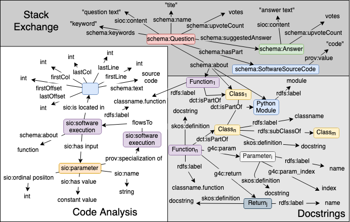

Knowledge graphs have proven extremely useful in powering diverse applications in semantic search and natural language understanding. Graph4Code is a knowledge graph about program code that can similarly power diverse applications such as program search, code understanding, refactoring, bug detection, and code automation.  The graph uses generic techniques to capture the semantics of Python code: the key nodes in the graph are classes, functions and methods in popular Python modules.  Edges indicate function usage (e.g., how data flows through function calls, as derived from program analysis of real code), and documentation about functions (e.g., code documentation, usage documentation, or forum discussions such as StackOverflow).  We make extensive use of named graphs in RDF to make the knowledge graph extensible by the community.  We describe a set of generic extraction techniques that we applied to over 1.3M Python files drawn from GitHub, over 2,300 Python modules, as well as 47M forum posts to generate a graph with over 2 billion triples. We also provide a number of initial use cases of the knowledge graph in code assistance, enforcing best practices, debugging and type inference. The graph and all its artifacts are available to the community for use. 

* Paper: [https://arxiv.org/abs/2002.09440](https://arxiv.org/abs/2002.09440)<br>
* Download Graph4Code dataset as nquads from [here](https://archive.org/download/graph4codev1).


### Table of Contents
1. [Graph4Code Pipeline](#pipeline)
2. [Loading and querying Graph4Code](./load_graph.md#loading)
3. [Toy Example](#toy_example)
4. [Schema](#schema)
5. [Deploying and using Graph4Code](#deploy)
6. [Generate your own graph](#process_new) 
7. [Example Queries](./example_queries.md)
8. [Example Use Cases](./use_cases.md)
    * [Recommendation engine for developers](./use_cases.md#case1)
    * [Enforcing best practices](./use_cases.md#case2)  
    * [Learning from big code](./use_cases.md#case3) 
9. [Publications](#papers)

### Graph4Code Pipeline<a name="pipeline"></a>

<!----->
<p align="center">

</p>
<br><br>

### Toy Example<a name="toy_example"></a>
To help better understand the structure of code graphs generated by Graph4Code, we show here a toy example for a small python program: <TO BE ADDED>
   
   
### Schema<a name="schema"></a>

The following shows a concept map of Graph4Code's overall schema, across the code analysis, Stack Exchange, and Docstrings extractions.

<p align="center">

</p>
<br><br>

We provide documentation of the schema in three parts:

1. [Code Analysis](code_analysis_schema.ttl)
2. [Docstrings](docstrings_schema.ttl)
3. [StackExchange](stackexchange_schema.ttl)

### Deploying and using Graph4Code <a name="deploy"></a>

The graph files are available [here](https://archive.org/download/graph4codev1). 

To load and query this data, please follow the instructions here: https://github.com/wala/graph4code/blob/master/docs/load_graph.md. We also provide scripts for creating a docker image with the graph database ready to use. 


### Processing new scripts <a name="process_new"></a>

If you have a new script, run the following command in the jars directory.  Please ensure you have Java 11 before you run.  Note that the last two arguments are to create a unique graph URI for each script that gets analyzed, where the graph URI is made up of <graph prefix> + '/' + <graph qualifier> for a single file.  Note also that we have migrated the RDF store model to RDF* to make it a more compact, easier to understand representation.  We have also added more information about each node.  Model definition will be updated soon.

We provide analysis for both Python 2 and Python 3.  Python 3 is the supported version of Python, but, while Python 2 is no longer supported, many existing datasets have significant quantities it.  Since the two languages have different syntax in some cases, we need two different analyses that rely on diffferent parsers, and hence we have two analysis jars.

Their usage is `java -DoutputDir=<output dir to store JSON representation of graph> -DquadFile=<file name to write quads to - this file gets appended to, so all analyzed scripts end up in a single file> -cp codebreaker*n*.jar util.RunTurtleSingleAnalysis <python script to run on> <graph prefix> <graph qualifier>` where *n* is either 2 or 3 depending on the desired version of Python.  As an example: `java -DoutputDir=<output dir to store JSON representation of graph> -cp codebreaker3.jar util.RunTurtleSingleAnalysis <python script to run on> null null` to run on a Python 3 file, with an output of the graph on JSON.
   
   
### Resources
* Download Graph4Code dataset as nquads from [here](https://archive.org/download/graph4codev1).
* A map of python classes with import names/paths; e.g. `sklearn.ensemble.RandomForestClassifier`, vs. actual class path; e.g.    `sklearn.ensemble._forest.RandomForestClassifier`, can be found [here](https://github.com/wala/graph4code/blob/master/resources/classes.map)

### Publications<a name="papers"></a>
* If you use Graph4Code in your research, please cite our work:

 ```
  @article{abdelaziz2020codebreaker,
  title={A Demonstration of CodeBreaker: A Machine Interpretable Knowledge Graph for Code},
  author={Abdelaziz, Ibrahim and Srinivas, Kavitha and Dolby, Julian and  McCusker, James P},
  journal={International Semantic Web Conference (ISWC) (Demonstration Track)},
  year={2020}
}
 @article{abdelaziz2020graph4code,
  title={Graph4Code: A Machine Interpretable Knowledge Graph for Code},
  author={Abdelaziz, Ibrahim and Dolby, Julian and  McCusker, James P and Srinivas, Kavitha},
  journal={arXiv preprint arXiv:2002.09440},
  year={2020}
}
```


