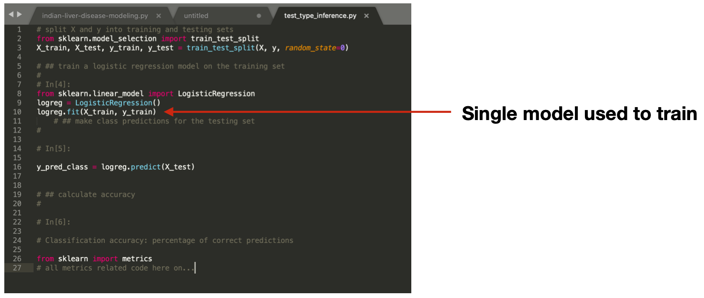
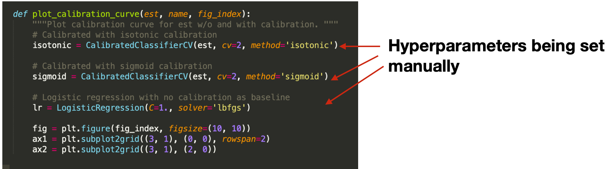
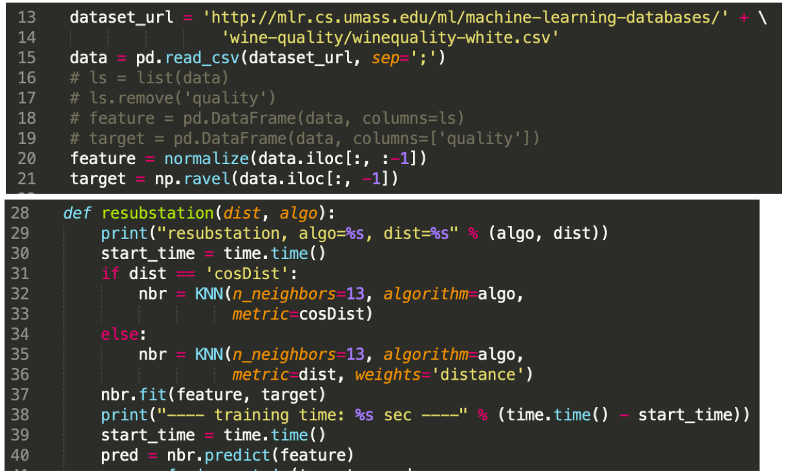
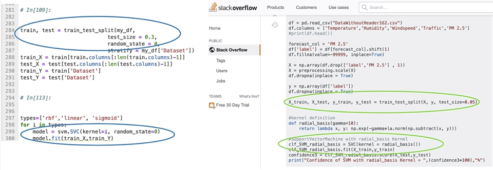
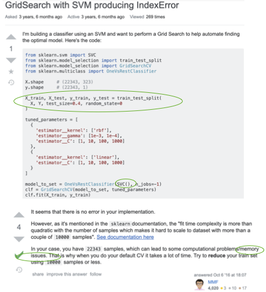
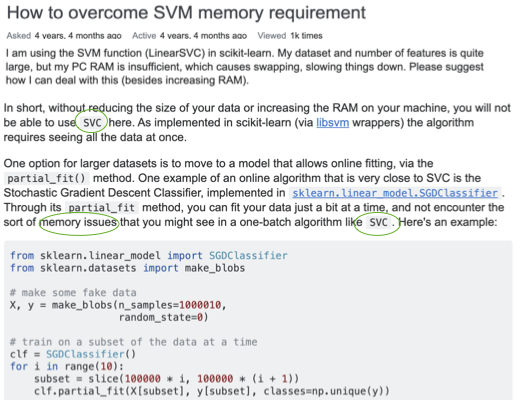
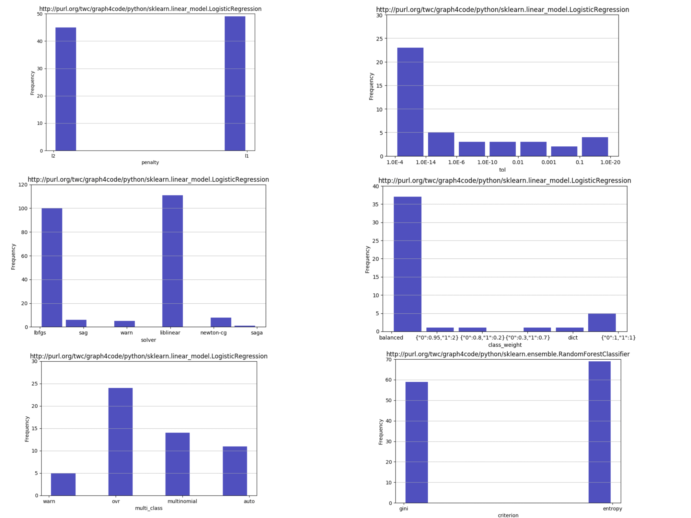

## Applications

### Automated Machine Learning 
AutoML systems build machine learning models automatically by performing a search over valid data transformations and learners, along with hyper-parameter optimization for each learner. We present a system called KGpip, based on GraphGen4Code analysis, for the selection of transformations and learners, which (1) builds a database of datasets and corresponding historically used pipelines using effective static analysis instead of the typical use of actual runtime information, (2) uses dataset embeddings to find similar datasets in the database based on its content instead of metadata-based features, (3) models AutoML pipeline creation as a graph generation problem, to succinctly characterize the diverse pipelines seen for a single dataset. KGpip is designed as a sub-component for AutoML systems. We demonstrate this ability via integrating KGpip with two AutoML systems and show that it does significantly enhance the performance of existing state-of-the-art systems. 

**Paper**: https://arxiv.org/abs/2111.00083

### Recommendation engine for developers
CodeBreaker is a coding assistant built on top of Graph4Code to help data scientists write code.  The coding assistant helps users find the most plausible next coding step, finds relevant stack overflow posts based purely on the users' code, and allows users to see what sorts of models other people have constructed for data flows similar to their own.  CodeBreaker uses the Language Server Protocol (LSP) to provide integration with any IDE.  For a detailed description of this use case, see the [demo paper](https://github.com/wala/graph4code/blob/master/papers/CodeBreaker_SigDemo.pdf). A video of this use case is also [here](https://github.com/wala/graph4code/blob/master/docs/figures/demo_v2.mp4).

**Paper**: http://ceur-ws.org/Vol-2721/paper568.pdf 

### Buildng Better Language Models for Code Understanding
Code understanding is an increasingly important application of Artificial Intelligence. A fundamental aspect of understanding code is understanding text about code, e.g., documentation and forum discussions. Pre-trained language models (e.g., BERT) are a popular approach for various NLP tasks, and there are now a variety of benchmarks, such as GLUE, to help improve the development of such models for natural language understanding. However, little is known about how well such models work on textual artifacts about code, and we are unaware of any systematic set of downstream tasks for such an evaluation. In this paper, we derive a set of benchmarks (BLANCA - Benchmarks for LANguage models on Coding Artifacts) that assess code understanding based on tasks such as predicting the best answer to a question in a forum post, finding related forum posts, or predicting classes related in a hierarchy from class documentation. We evaluate the performance of current state-of-the-art language models on these tasks and show that there is a significant improvement on each task from fine tuning. We also show that multi-task training over BLANCA tasks helps build better language models for code understanding. 

**Paper**: https://arxiv.org/abs/2109.07452

**Code**: https://github.com/wala/blanca

### Enforcing best practices
Many best practices for API frameworks can be encoded into query templates over data flow and control flow.  Here we give three such examples for data science code, along with queries which can be templatized.
  
  * Check that users developing data science code create multiple models on the same dataset, since machine learning algorithms vary greatly in terms of performance on different datasets ([see query here](https://github.com/wala/graph4code/blob/master/usage_queries/ensure_multiple_models.sparql)).  Here is an example result from the query.  As shown in the example, only one model is used to train ona  given dataset.

  

  * Check that the users use some sort of libraries for hyper-parameter optimization when building their models ([see query here](https://github.com/wala/graph4code/blob/master/usage_queries/must_not_set_hyperparameters.sparql)).  Here is an example result from the query - the analysis found all three examples of manual sets to hyperparameters.

  

  * Check that users developing data science code create the model with a different dataset than the ones they use to validate the model ([see query here](https://github.com/wala/graph4code/blob/master/usage_queries/train_test_different_data.sparql)).

  

### Debugging with Stackoverflow
A common use of sites such as StackOverflow is to search for posts related to an issue with a developer's code, often a crash.  
In this use case, we show an example of searching StackOverflow using the code context in the following figure, based on the highlighted code locations found with dataflow to the {\tt fit} call.

  

Such a search on Graph4Code does produce the StackOverflow result shown above based on links with the coding context, specifically the `train_test_split` and `SVC.fit` call as one might expect.  Suppose we had given `SVC` a very large dataset, and the fit call had memory issues; we could augment the query to look for posts that mention `memory issue', in addition to taking the code context shown in the above figure into consideration.  The figure below shows the first result returned by such a query over the knowledge graph.  As shown in the figure, this hit is ranked highest because it matches both the code context in motivating figure  highlighted with green ellipses, and the terms "memory issue" in the text.  What is interesting is that, despite its irrelevant title, the answer is actually a valid one for the problem.  

  
A text search on StackOverflow with `sklearn`, `SVC` and `memory issues` as terms does not return this answer in the top 10 results.  We show below the second result, which is the first result returned by a text search on StackOverflow.  Note that our system ranks this lower because the coding context does not match the result as closely.

  

### Learning from big code 

There has been an explosion of work on mining large open domain repositories for a wide variety of tasks (see [here](https://ml4code.github.io/papers.html)).  We sketch a couple of examples for how Graph4Code can be used in this context.
  * As an example, again, from a data science use case, the arguments flowing into constructors of models govern the behavior of a model to a large extent.   These so-called hyperparameters are often optimized by some sort of search technique over the space of parameters.  Hyperparameter optimization can be seeded with the appropriate values using query here to restrict search, using any of the standard hyper parameter optimization packages ([see query here](https://github.com/wala/graph4code/blob/master/usage_queries/find_hyperparameter_distributions.sparql)).

  

  * The graphs themselves can be used to perform automated code generation by using them as training sets.  As an example, [Code2seq](https://arxiv.org/pdf/1808.01400.pdf) is a system that generates natural language statements about code (e.g. predicting Java method names) or code captioning (summarizing code snippets).  Code2seq is based on an AST representation of code.  Graph4Code can be used to generate richer representations which may be better suited to generate code captioning.
